<div dir="rtl">

# متجر إلكتروني — E-Commerce

  

## نبذة عن المشروع

واجهة متجر إلكتروني أمامية متقدمة مبنية بـ **Next.js (App Router)** و **Tailwind CSS**، منظمة كمكونات قابلة لإعادة الاستخدام مع دعم تعدد اللغات عبر **next-intl**. المشروع مصمم لعرض المنتجات والعروض والفئات بطريقة احترافية وقابلة للتوسيع.

## المزايا الرئيسية

✨ **الأداء السريع** - استخدام Next.js مع تحسينات SSR و SSG  
🌐 **تعدد اللغات** - دعم كامل للعربية والإنجليزية  
📱 **التجاوب التام** - متوافق مع جميع الأجهزة  
🛒 **تجربة تسوق متكاملة** - سلة تسوق، قائمة المفضلة، إدارة الحساب  
🔒 **الأمان** - نظام مصادقة متقدم

## التقنيات المستخدمة

- **Frontend**: Next.js 15.5, TypeScript
- **Styling**: Tailwind CSS, Radix UI
- **Internationalization**: next-intl
- **State Management**: Redux Toolkit
- **UI Components**: Swiper, lucide-react, react-icons
- **Backend (اختياري)**: Firebase

## الميزات المتقدمة

- 🔍 **البحث الذكي** - بحث متطور في المنتجات
- 🏷️ **الفئات الديناميكية** - تصفح حسب الفئات
- ⭐ **الأكثر مبيعاً** - عرض المنتجات الشائعة
- 💰 **العروض الخاصة** - قسم Flash Sales

## هيكل الملفات

```
src/
├── app/
│   └── [locale]/
│       ├── page.tsx          # الصفحة الرئيسية
│       └── layout.tsx        # تخطيط عام مع دعم الترجمة
├── components/               # المكونات القابلة لإعادة الاستخدام
├── i18n/                    # إعدادات الترجمة
├── locales/
│   ├── ar/                  # ملفات الترجمة العربية
│   └── en/                  # ملفات الترجمة الإنجليزية
└── screenshots/             # صور المشروع
```

## التشغيل المحلي

1. **تثبيت التبعيات:**

```bash
npm install
```

2. **تشغيل بيئة التطوير:**

```bash
npm run dev
```

3. **الوصول للموقع:**

```
http://localhost:3000
```

## البناء للإنتاج

```bash
npm run build
npm start
```

## لقطات الشاشة

### الصفحة الرئيسية

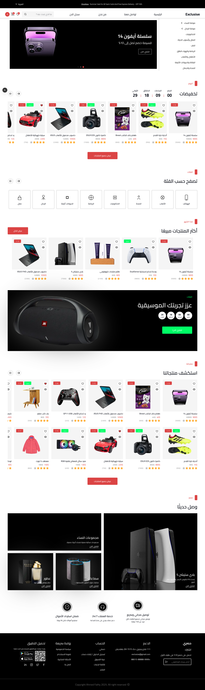
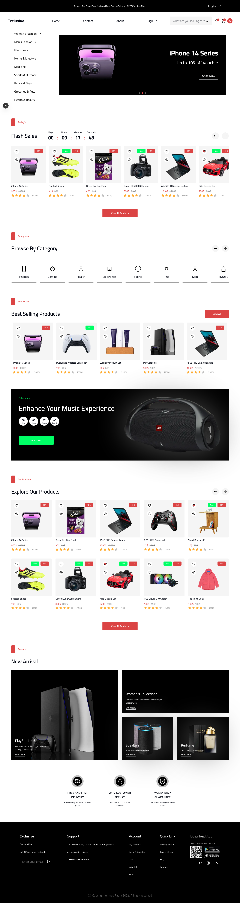

### صفحات المنتجات

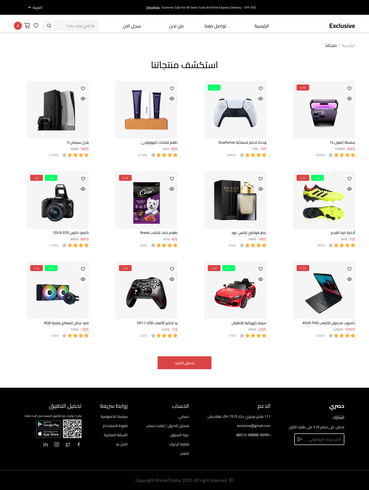
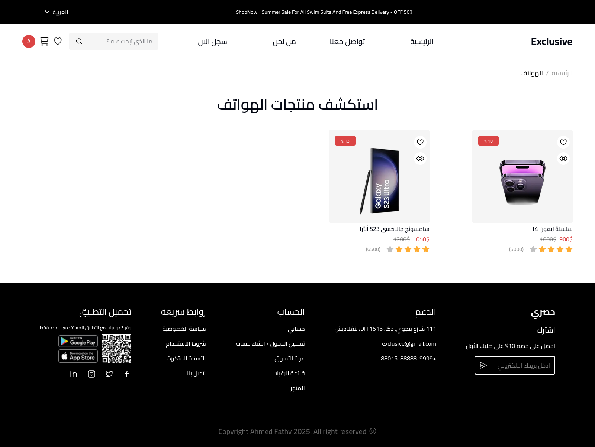
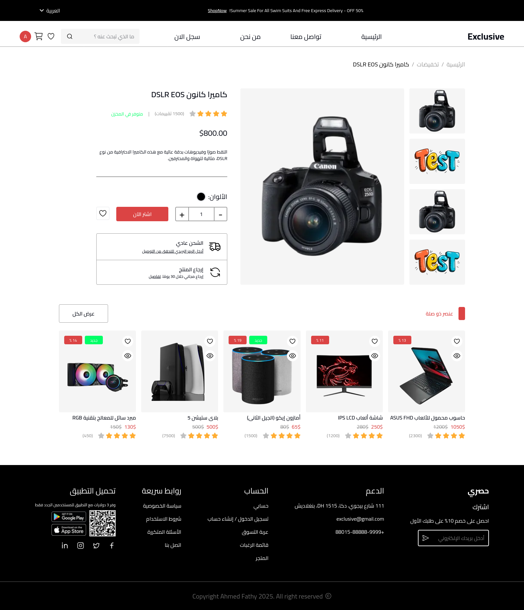

### إدارة التسوق


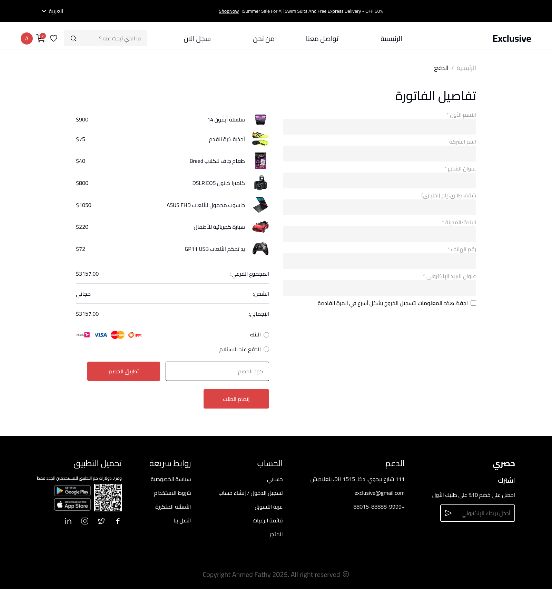
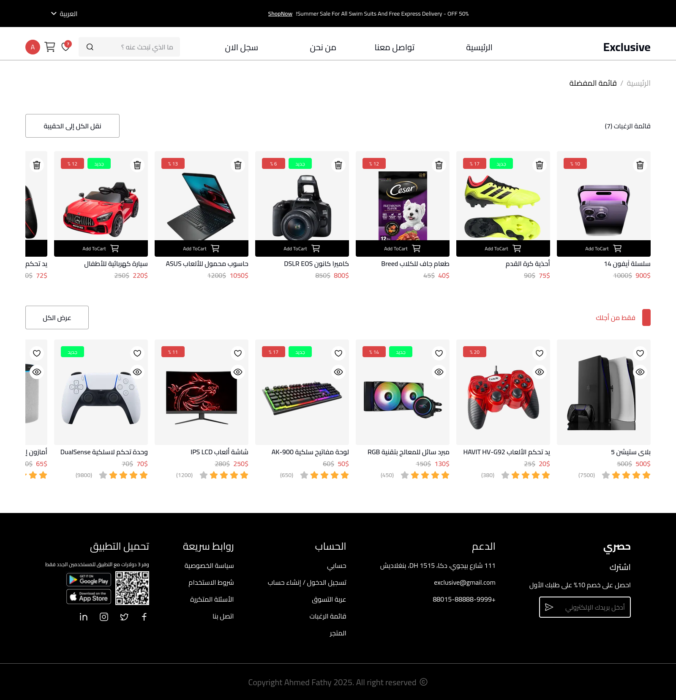

### صفحات المستخدم

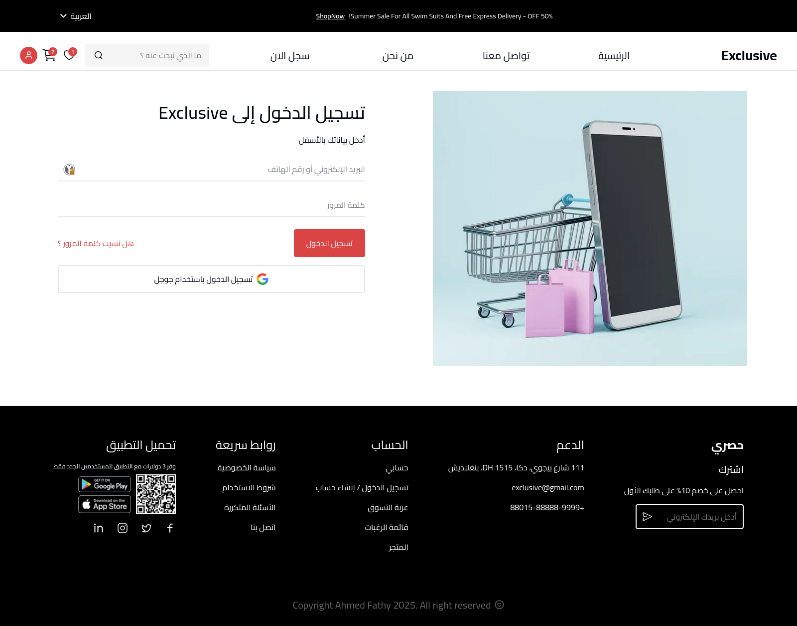
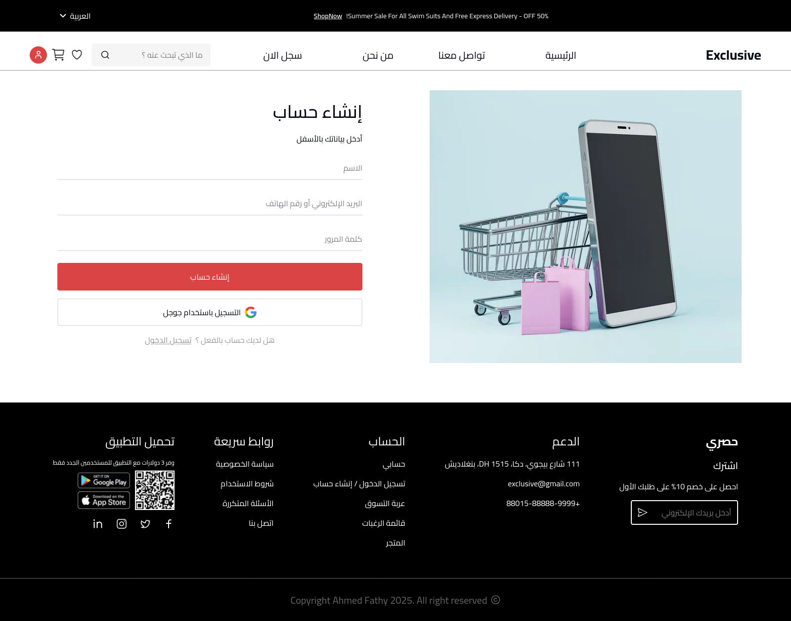
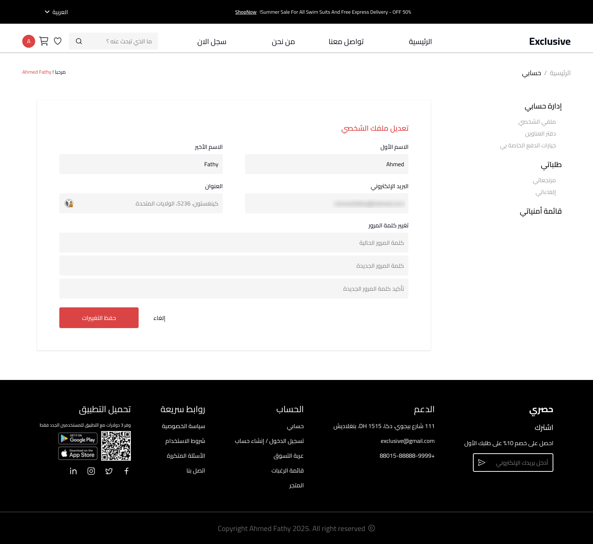

### واجهات أخرى

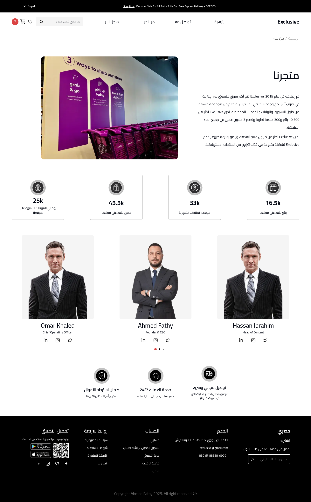
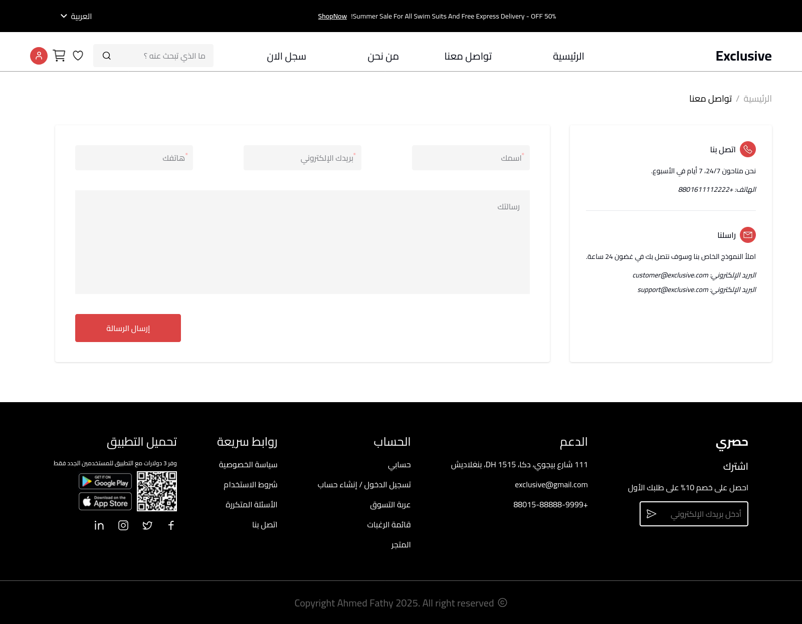
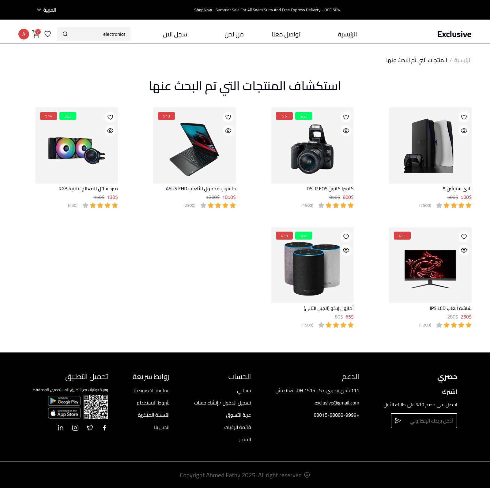
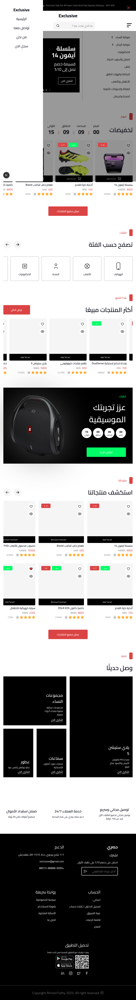

### التجاوب

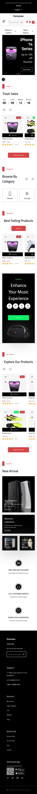
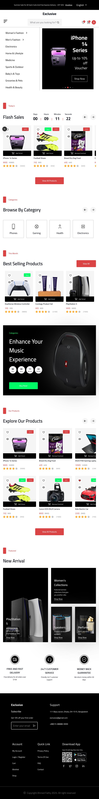

---

<div dir="ltr">

**Made with ❤️ by <a href="https://www.linkedin.com/in/iahmedfathy/">Ahmed Fathy</a>**

</div>

</div>
